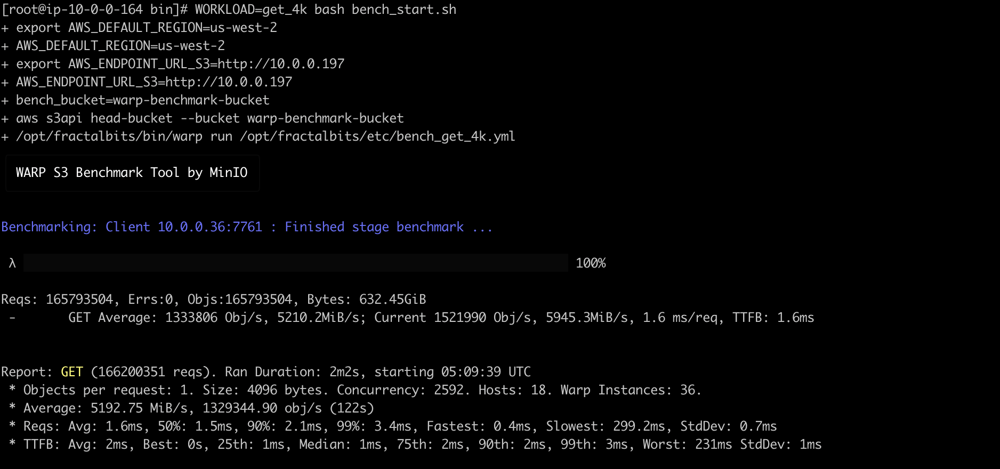

# FractalBits

**High-Performance S3-Compatible Object Storage**

[](https://github.com/fractalbits-labs/fractalbits/actions/workflows/ci.yml)
[](https://opensource.org/licenses/Apache-2.0)

> **Beta Software**: FractalBits is currently in beta. While it demonstrates exceptional performance, we recommend thorough testing before production use. We welcome feedback, bug reports, and contributions!

## Overview

FractalBits is an S3-compatible object storage system designed for high performance and low latency. Using our custom-built storage engine, it delivers up to **1 Million 4K-object reads per second** for a single bucket with P99 latency ~5ms, at significantly lower cost than AWS S3 Express One Zone. Unlike standard S3, FractalBits provides native **atomic rename support for both objects and directories**.

The **Fractal ART** (Adaptive Radix Tree) storage engine serves two roles: as the **metadata** engine it uses a full-path name approach that avoids the heavy distributed transactions required by traditional inode-based systems, achieving superior scalability while still providing directory semantics including atomic rename. As the **local data** engine it is SSD-optimized with a low-overhead I/O path, so performance scales directly with the underlying NVMe hardware. This makes FractalBits ideal for AI training pipelines and data analytics workflows that require atomic operations for managing datasets and checkpoints.

Built with Rust for the API gateway and control plane, and io_uring for asynchronous I/O for the performance-critical storage engine and data plane. This combination enables millions of operations per second while maintaining low latency.

**Key Highlights:**

- **~1M Objects/s** (4KB objects) for single bucket with P99 latency ~5ms
- **Atomic rename support** for both objects and directories - native capability that standard S3 lacks
- **Fractal ART metadata engine** - full-path approach for high-performance metadata with atomic rename semantics
- **Fractal ART data engine** - low-overhead SSD-optimized I/O path that scales with the underlying NVMe hardware
- **Cost-efficient** - significantly lower cost than AWS S3 Express One Zone for small object workloads
- **5-minute Bring Your Own Cloud (BYOC)** - to **any** AWS/GCP region with `just deploy`

## Performance Benchmarks

FractalBits delivers exceptional performance that exceeds AWS S3 Express One Zone:

### GET Workload

| Metric      | Value  |
| ----------- | ------ |
| Obj/s       | 980K   |
| Avg Latency | 2.9 ms |
| P99 Latency | 5.3 ms |


*Benchmark screenshot showing GET performance with 4KB objects reaching ~1M Objects/s*

### PUT Workload

| Metric      | Value  |
| ----------- | ------ |
| Obj/s       | 333K   |
| Avg Latency | 4.4 ms |

**Benchmark Configuration:**

- Object size: 4 KiB
- Instance types: 14 c8g.xlarge (API), 6 i8g.2xlarge (BSS), 1 r7g.4xlarge (NSS)
- Cost: ~$8/hour based on AWS on-demand EC2 instance pricing
- Replication: 3-way data blob quorum, 6-way metadata blob quorum
- AWS Region: us-west-2
- Workload: warp-based S3 load testing

*You can verify these performance metrics yourself by following the [Bring Your Own Cloud (BYOC)](#byocbring-your-own-cloud) section below.*

## Architecture

For detailed information about FractalBits' architecture, components, technology stack, and design decisions, see [Architecture Documentation](docs/internals/ARCHITECTURE.md).

## Quick Start - Local Development

### Prerequisites

For detailed information about development prerequisites and setup, see the [Prerequisites section in HACKING.md](docs/HACKING.md#prerequisites).

**Note**: This guide uses [`just`](https://github.com/casey/just) command runner for convenience. All `just` commands can also be run using `cargo xtask` (e.g., `cargo xtask build`, `cargo xtask service`).

### Build

Clone the repository and build all components:

```bash
git clone https://github.com/fractalbits-labs/fractalbits.git
cd fractalbits

# Initialize repo
just repo init

# Build all components
just build
```

### Update

After pulling new changes from upstream, refresh the prebuilt binaries to the
latest published revision:

```bash
# Pull latest main-repo changes
git pull --rebase # or other git commands to fetch the latest main repo changes

# Refresh prebuilt binaries (shallow re-clone of the prebuilt repo)
just prebuilt update
```

`just prebuilt update` removes `prebuilt/` and shallow-clones the tip of the
prebuilt repo (the latest published prebuilt binaries).

### Run Services

Initialize and start all services locally:

```bash
# Initialize service configuration
just service init

# Start all services (API, BSS, NSS, RSS)
just service start

# Check service status
just service status

# Check service with normal systemd commands
systemctl --user status api_server
journalctl --user -u api_server
```

Services will be available at:

- **API Server**: `http://localhost:8080` (S3 API endpoint)

### Basic Usage Example

Once services are running, use any S3-compatible client:

```bash
# Export AWS environment variables to use our own service
export AWS_DEFAULT_REGION=localdev
export AWS_ENDPOINT_URL_S3=http://localhost:8080
export AWS_ACCESS_KEY_ID=test_api_key
export AWS_SECRET_ACCESS_KEY=test_api_secret

# Create a bucket
aws s3 mb s3://my-bucket

# Upload an object
echo 'Hello FractalBits!' > test.txt
aws s3 cp test.txt s3://my-bucket/

# Download an object
aws s3 cp s3://my-bucket/test.txt downloaded.txt

# List objects
aws s3 ls s3://my-bucket

# Stop services when done
just service stop

# Unset environment variables, or exit
unset AWS_DEFAULT_REGION AWS_ENDPOINT_URL_S3 AWS_ACCESS_KEY_ID AWS_SECRET_ACCESS_KEY
```

### Run Tests

Execute the S3 API compatibility test suite:

```bash
# Run S3 API regression tests
just precheckin --s3-api-only

# Run with all unit tests also
just precheckin
```

## Quick Start - Docker

Run FractalBits in a single Docker container for quick testing and evaluation.
The Docker image bundles all services (API server, BSS, NSS, RSS) into a single
container orchestrated by the `container-all-in-one` binary.

### Using `just` Commands (Recommended)

```bash
# Build Docker image (uses debug build by default)
just docker build

# Build release Docker image
just docker build --release

# Run container (foreground)
just docker run

# Run container with custom port
just docker run --port 9080

# Run container in background
just docker run --detach --name fractalbits-dev

# View logs
just docker logs --name fractalbits-dev --follow

# Stop container
just docker stop --name fractalbits-dev
```

### Using Docker Directly

The container requires `--privileged` mode because the storage engine uses io_uring for high-performance async I/O.

```bash
# Run the latest image
docker run --rm --privileged -p 8080:8080 ghcr.io/fractalbits-labs/fractalbits:latest

# Run a specific version
docker run --rm --privileged -p 8080:8080 ghcr.io/fractalbits-labs/fractalbits:<commit-sha>

# Run your custom-built image (after `cargo xtask docker build`)
docker run --rm --privileged -p 8080:8080 fractalbits:latest

# Run in background with persistent data
docker run -d --privileged --name fractalbits \
    -p 8080:8080 \
    -v fractalbits-data:/data \
    ghcr.io/fractalbits-labs/fractalbits:latest
```

Once running, see [Basic Usage Example](#basic-usage-example) for S3 client commands.

## Bring Your Own Cloud (BYOC)

FractalBits makes BYOC simple: build once, deploy with a single command, and launch a fully operational cloud storage system on AWS/GCP in under 5 minutes.

### Building from Source (Optional)

By default, deployment uses prebuilt binaries. To build and deploy your own binaries:

```bash
# Make sure cargo-zigbuild is installed for cross-compilation
cargo install --locked cargo-zigbuild

# Build binaries for deployment
just deploy build
```

### Deploy to AWS

Make sure your [AWS CLI Configuration Settings](https://docs.aws.amazon.com/cli/v1/userguide/cli-configure-files.html) are set up correctly.

```bash
# Deploy with perf_demo template (14 API servers, 42 bench clients, 6 BSS nodes)
# Use "mini" template for a single instance of each node type.
just deploy create-vpc --template perf_demo --with-bench

# View deployed stack information
just describe-stack

# Log into ec2 instance nodes
aws ssm start-session --target <ec2-instance-id>

# If the VPC is created with `--with-bench`, you can log into bench_server to run
# pre-defined benchmark workloads (get_4k, put_4k, mixed_4k, get_64k, put_64k, mixed_64k)
WORKLOAD=get_4k /opt/fractalbits/bin/bench_start.sh

# Destroy VPC infrastructure (including S3 builds bucket cleanup), which needs confirmation
just deploy destroy-vpc
```

## S3 API Compatibility

FractalBits supports the most commonly used S3 operations with full AWS Signature V4 authentication. For complete details including supported operations, extension APIs, authentication, and limitations, see [S3 API Compatibility](docs/S3_API_COMPATIBILITY.md).

We're actively working on expanding S3 API coverage. See our [Roadmap](docs/ROADMAP.md) for planned features and timeline.

## Support

- 📖 **Documentation**: See [docs/](docs/) directory
- 🐛 **Bug Reports**: [GitHub Issues](https://github.com/fractalbits-labs/fractalbits/issues)
- 💬 **Discussions**: [GitHub Discussions](https://github.com/fractalbits-labs/fractalbits/discussions)
- 👥 **Discord**: [Join FractalBits Community](https://discord.com/invite/tXRq5H3urv)
- 📧 **Email**: founders@fractalbits.com (for private inquiries)

---

**Built with ❤️ for high-performance object storage**
